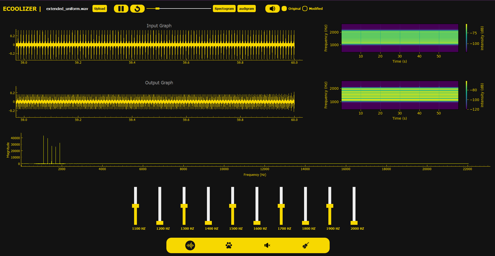
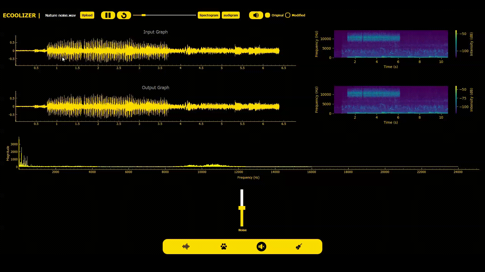

<h1 align="center">
    
</h1>

<h1 align="center">eCOOLizer</h1>
<h3 align="center">Signal Equalizer Application</h3>

<h4 align="center"> 
	 Status: Finished
</h4>

<p align="center">
 <a href="#about">About</a> •
 <a href="#features">Features</a> •
 <a href="#how-it-works">How it works</a> • 
 <a href="#tech-stack">Tech Stack</a> •  
 <a href="#developers">Developers</a>
</p>

# About

**Ecoolizer**  is a desktop application designed for audio signal manipulation. It allows users to modify the magnitude of frequency components in audio files through an intuitive user interface featuring sliders and viewers. This app is useful for music and speech industry as well as biomedical applications such as hearing aid tuning and abnormality detection.

---

## Features

- **Modes of Operation**: The application offers four modes of operation:
    - **Uniform Range Mode**:
        - Divides the total frequency range into 10 equal ranges, each controlled by a slider.
    

    - **Instruments + Animals Mode**:
        - Control specific Instruments as sax, chimes.
        - Control animals like frog, owl, cricket.

    - **Music + Vowels Mode:**:
        - Upload a song and control specific components in it : drums, clapping, triangle, "S" letter, and "Sh" letter.
        
    - **Weiner Filter**:
        - Select a portion of the signal to suppress noise by making the selected part reduced or disappear.
    


- **Visualization Tools**:
    - **Fourier Transform Graphs**:
        - Flexibility to display frequency range in linear or Audiogram scale.
    - **Linked Input/Output Graphs**:
        -Linked viewers for real-time input and output signals.
        -Synchronous scrolling, pause, play, speed and zooming between viewers to maintain exact time-part alignment.
    - **Spectrograms**:
        - Toggle option to show/hide spectrograms for both input and output signals.
        -Dynamically updated upon changes in slider.
    - **Audio Playback**:
        - Users can listen to the audio before and after modifications to compare changes.

        

 
</p>

## Tech Stack

The following tools were used in the construction of the project:

- **[Python](https://www.python.org/)**
- **[PyQt5](https://riverbankcomputing.com/software/pyqt/intro)**
- **[PyQtGraph](https://www.pyqtgraph.org/)**
- **[NumPy](https://numpy.org/)**
- **[Matplotlib](https://matplotlib.org/)**
- **[Pandas](https://pandas.pydata.org/)**
- **[Scipy](https://scipy.org/)**
- **[soundfile](https://pypi.org/project/soundfile/)**
- **[sounddevice](https://pypi.org/project/sounddevice/)**

---


## How it Works

The application provides a user-friendly interface for signal manipulation. Users can load an audio file, choose an operation mode, and adjust sliders to modify specific frequency components and then hear the audio before and after modifications. Real-time visualization tools reflect changes dynamically.

### Pre-requisites

Before running the application, make sure you have **Python** installed on your system. You will also need **pip** for installing dependencies.

---

## How to Run the Project Locally

To run the project locally, follow these steps:

### Steps:

1. **Clone the repository:**
   ```bash
   git clone https://github.com/your-username/eCOOLizer.git
   ```

2. **Navigate to the project folder:**
   ```bash
   cd eCOOLizer
   ```


3. **Install the required dependencies:**
   ```bash
   pyqt5
   pyqtgraph
   numpy
   matplotlib
   pandas
   ```

5. **Run the application:**
   ```bash
   python main.py
   ```

This will start the **eCOOLizer** application locally.

---

## Developers

| [**Talal Emara**](https://github.com/TalalEmara) | [**Meram Mahmoud**](https://github.com/Meram-Mahmoud) | [**Maya Mohammed**](https://github.com/Mayamohamed207) | [**Nouran Hani**](https://github.com/Nouran-Hani) | [**Nariman Ahmed**](https://github.com/nariman-ahmed) |
|:------------------------------------------:|:------------------------------------------:|:------------------------------------------:|:------------------------------------------:|:------------------------------------------:|


## Learn More

To learn more about PyQt5 and PyQtGraph, check out their official documentation:

- [PyQt5 Documentation](https://riverbankcomputing.com/software/pyqt/intro)
- [PyQtGraph Documentation](https://www.pyqtgraph.org/)
